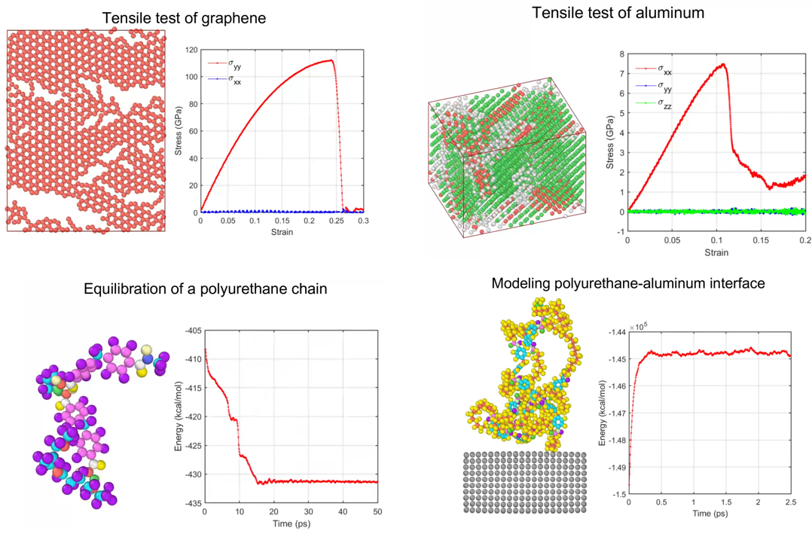

# LAMMPS tutorials for short courses

An overview of four tutorials is shown velow. A movie of the tutorials is [available here.](https://youtu.be/CBFVeW0Jb18)

 
 
More information on the graphene_tensile_tests tutorial is [available here](https://www.linkedin.com/pulse/how-perform-uniaxial-tensile-tests-graphene-sample-lammps-dewapriya/) and information on the polyurethane_aluminum_interface tutorial is [available here](https://github.com/nuwan-d/polymer_metal_interface/blob/master/README.md).
